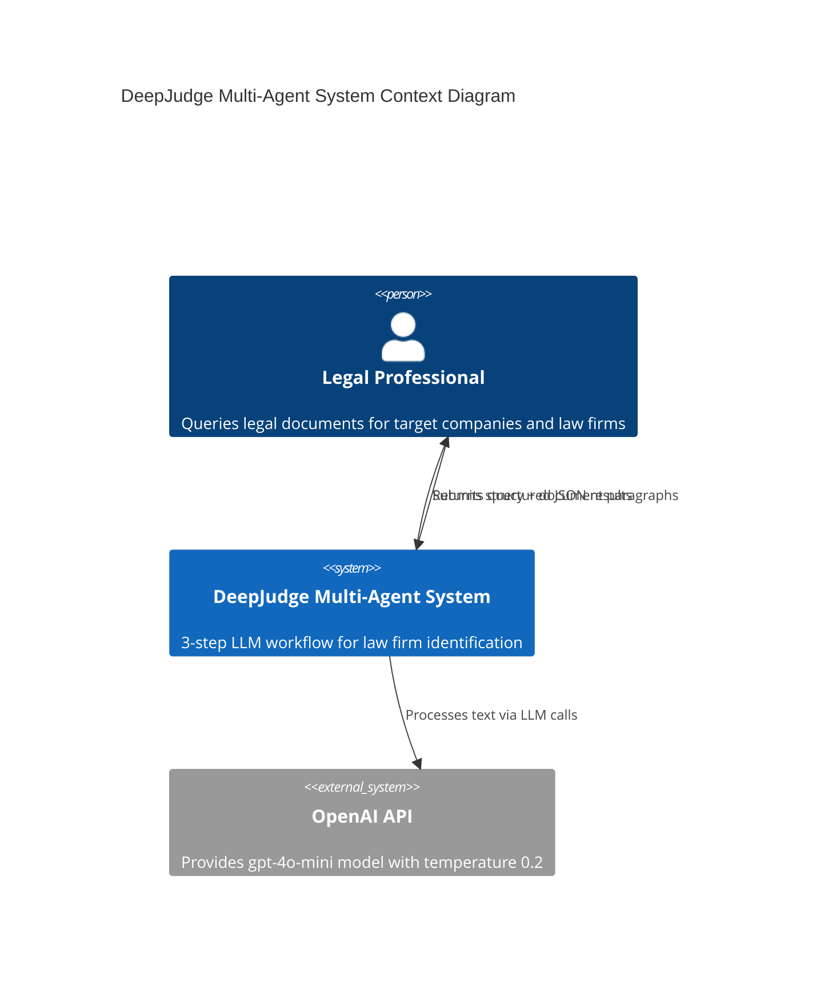
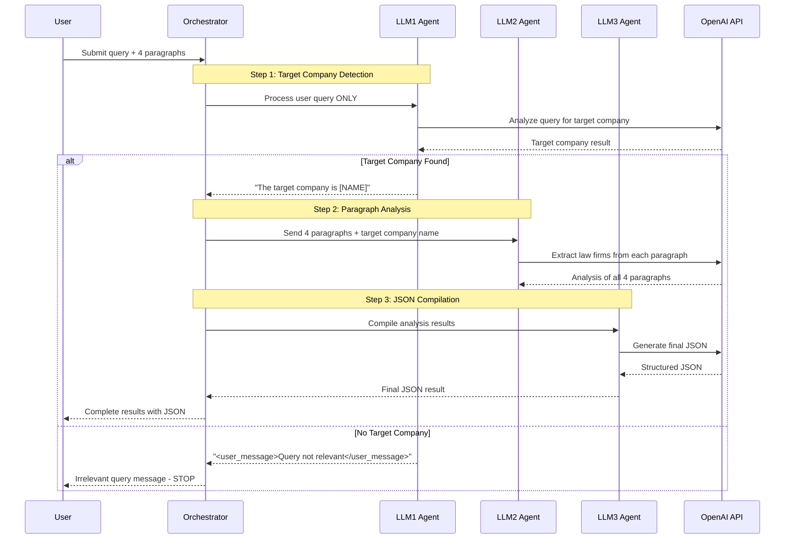
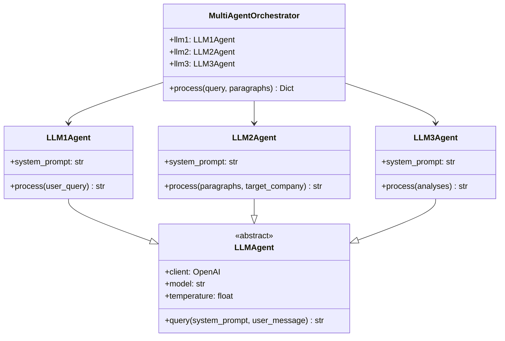

# DeepJudge Multi-Agent System

Multi-agent system for **Target Company & Law Firm Identification** based on the DeepJudge assignment specifications.

## Overview

This system implements a 3-step LLM workflow using `gpt-4o-mini` with temperature 0.2:

1. **LLM1**: Target company detection in user queries
2. **LLM2**: Law firm extraction from document paragraphs  
3. **LLM3**: JSON compilation and formatting

## Features

- **Sequential multi-agent processing**
- **Structured JSON output** with required fields:
  - `buyer_firm`: Buyer's representative law firm
  - `seller_firm`: Seller's representative law firm  
  - `third_party`: Third-party law firm
  - `contains_target_firm`: Boolean indicating target company presence

## Setup

1. **Install dependencies**:
   ```bash
   pip install openai python-dotenv pydantic
   ```

2. **Set up environment**:
   ```bash
   cp .env.example .env
   # Add your OpenAI API key to .env
   ```

3. **Run the system**:
   ```bash
   python main.py
   ```

## Architecture

### System Overview



### Workflow Sequence



### Component Architecture



### Agent Details

#### LLM1Agent - Target Company Detection
- **Input**: User query ONLY (does NOT receive document paragraphs)
- **Function**: Determines if query mentions a target company to search for
- **Output**: `"The target company is [NAME]"` or `<user_message>Query is not relevant to the intended task.</user_message>`
- **Critical**: When no target company found, system **STOPS** - no further processing

#### LLM2Agent - Paragraph Analysis  
- **Input**: Array of exactly 4 paragraphs + target company name (from LLM1)
- **Function**: Analyzes each paragraph independently within single LLM call
- **Extracts**: Buyer/seller/third-party law firms for each paragraph
- **Checks**: Target company presence in each paragraph
- **Output**: Structured analysis for all 4 paragraphs

#### LLM3Agent - JSON Compilation
- **Input**: LLM2's structured analysis of all 4 paragraphs
- **Function**: Compiles information into final JSON format
- **Output**: Structured JSON with required fields (`buyer_firm`, `seller_firm`, `third_party`, `contains_target_firm`)
- **Defaults**: "unknown" for missing law firms, `false` for target company presence

#### MultiAgentOrchestrator
- Coordinates the 3-step workflow
- Validates exactly 4 paragraphs are provided
- Handles error cases and JSON validation
- Provides comprehensive result objects

## Testing

The system includes test cases with the sample data from the assignment:

- **Positive case**: "Is Kirkland & Ellis present in the agreement?"
- **Negative case**: Irrelevant queries without target companies

## System Prompts

All system prompts are available in `system_prompts.py` for submission to the DeepJudge evaluation system.

## Example Output

```json
{
  "buyer_firm": "Shearman & Sterling LLP",
  "seller_firm": "Cleary Gottlieb Steen & Hamilton LLP", 
  "third_party": "Gibson, Dunn & Crutcher LLP",
  "contains_target_firm": false
}
```