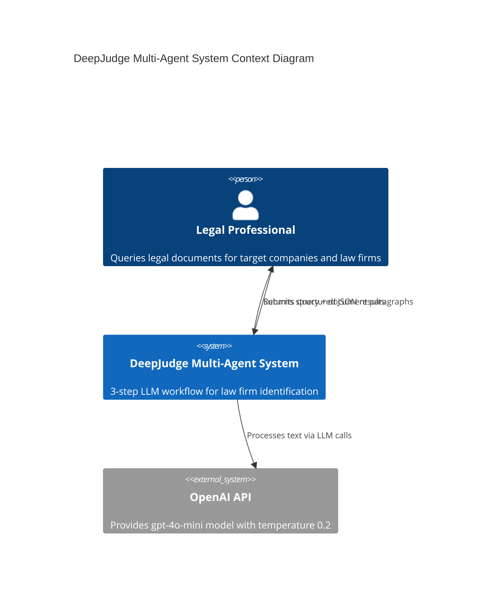
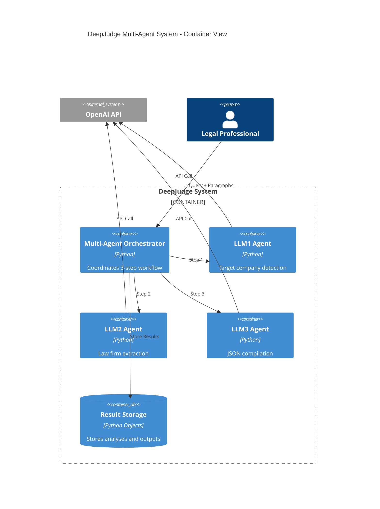
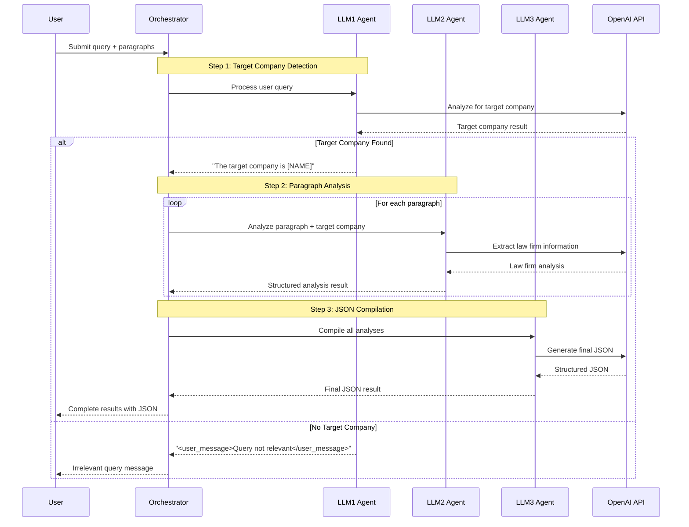
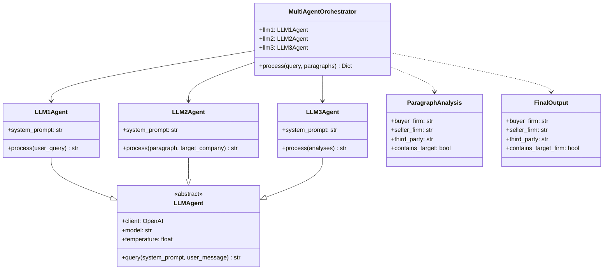
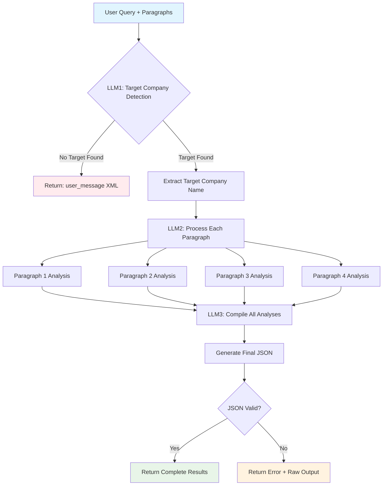
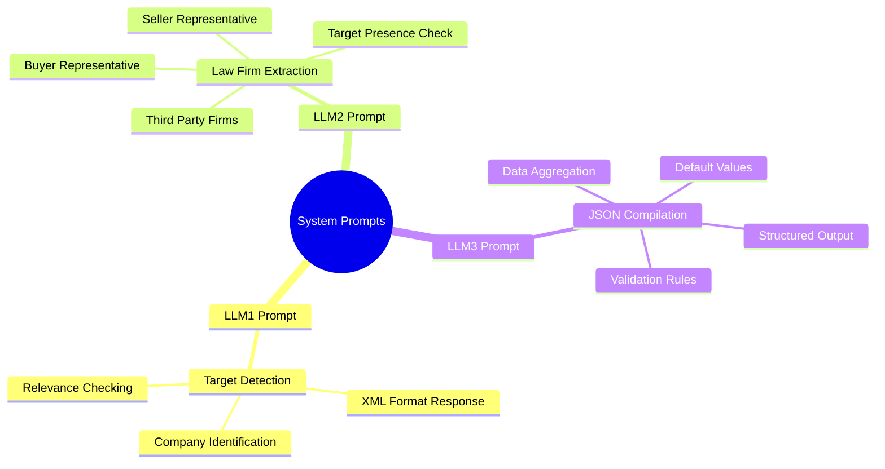
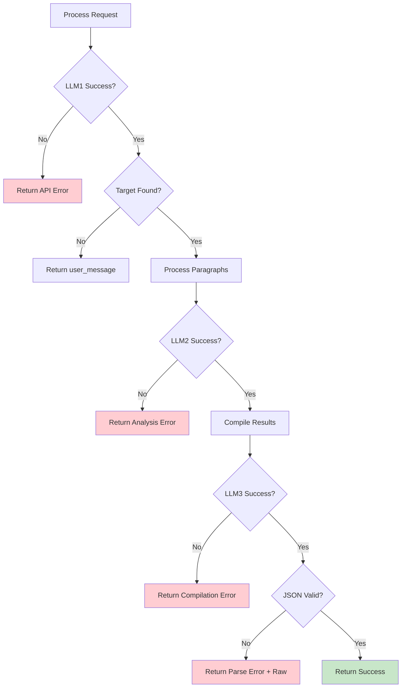
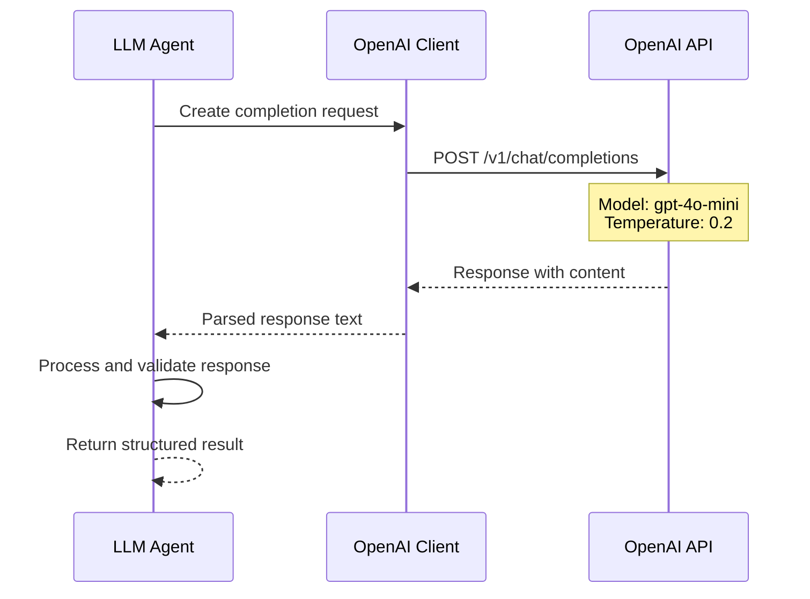

# DeepJudge Multi-Agent System - Architecture Documentation

## System Architecture Overview

## Container Diagram

## Workflow Sequence Diagram

## Component Architecture

## Data Flow Architecture

## System Prompts Architecture

## Error Handling Flow

## API Integration Pattern

